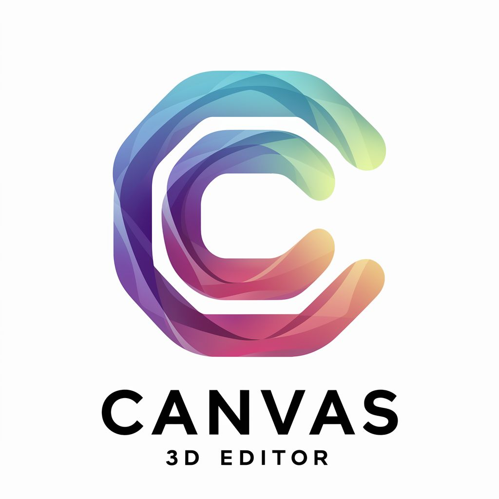

<div align="center">
   
</div>

# CANVAS - 3D editor for the AI-enhanced differentiable Ray Tracer ARTIST

[](https://www.python.org/downloads/)
[](https://github.com/psf/black)

## Installation
We heavily recommend to install `CANVAS` package in a dedicated `Python3.8+` virtual environment.

 ```bash
 git clone https://github.com/ARTIST-Association/CANVAS.git
 ```

## How to use CANVAS
We plan to provide an official *ReadTheDocs* documentation including exemplary usage scripts.

## How to contribute
Check out our [contribution guidelines](CONTRIBUTING.md) if you are interested in contributing to the `CANVAS` project :fire:.
Please also carefully check our [code of conduct](CODE_OF_CONDUCT.md) :blue_heart:.

## License
Liberally licensed under MIT.

## Documentation
Coming soon :rocket:!

## Acknowledgments
This work is supported by the [Helmholtz AI](https://www.helmholtz.ai/) platform grant.

-----------
<div align="center">
  <a href="https://www.dlr.de/EN/Home/home_node.html"></a>
  <a href="http://www.kit.edu/english/index.php"></a>
  <a href="https://www.helmholtz.ai/"></a>
</div>
